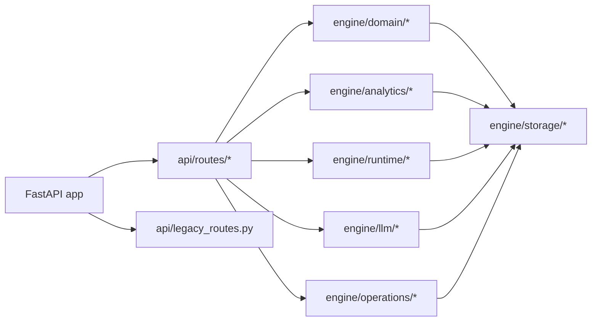
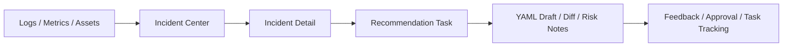
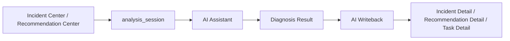

# opsMind Architecture

## Overview

`opsMind` is a full-stack operations analytics product that brings traffic, resources, incidents, recommendations, tasks, and AI-assisted diagnosis into a single product flow.

The primary chain is:

```text
logs / metrics / assets
  -> traffic / resource analytics
  -> incidents
  -> recommendations
  -> tasks / traces / artifacts
  -> ai assistant / quality metrics
```

## Runtime Composition

The backend entry point is [main.py](../main.py). FastAPI lifespan initializes the following shared capabilities:

- SQLite storage and repositories
- Task runtime, trace storage, and artifact storage
- Asset, signal, incident, and recommendation services
- AI provider config and router
- Executor plugins
- WebSocket event notifications



## Backend Modules

### API Layer

- [api/routes](../api/routes) is the primary product API entry
- [api/routes/__init__.py](../api/routes/__init__.py) aggregates the main product routes
- [api/legacy_routes.py](../api/legacy_routes.py) is retained only for debug and compatibility purposes

### Runtime Layer

[engine/runtime](../engine/runtime) provides the core task runtime:

- `models.py`: shared task, evidence, session, and writeback models
- `task_manager.py`: task creation, restore, and lifecycle progression
- `state_machine.py`: task transition constraints
- `trace_store.py`: trace persistence
- `artifact_store.py`: externalized artifact storage
- `event_bus.py`: task event broadcasting

### Domain Layer

[engine/domain](../engine/domain) contains business-facing product logic:

- `asset_service.py`
- `signal_service.py`
- `incident_service.py`
- `recommendation_service.py`

### Analytics Layer

[engine/analytics](../engine/analytics) powers the product analytics:

- `traffic_analytics.py`
- `resource_analytics.py`
- `correlation_engine.py`
- `summary_builder.py`

### AI Layer

[engine/llm](../engine/llm) provides:

- provider configuration and default model selection
- router, retry, and fallback handling
- structured output protection
- AI call logging

`/api/ai/*` is the main AI integration surface for the assistant, review flows, and provider management.

### Operations Layer

[engine/operations](../engine/operations) provides read-only operational diagnostics:

- executor plugin registration
- Linux / Docker / Kubernetes read-only command packs
- execution audit, timeout, and task linkage

Executor output can be turned back into evidence for incidents and recommendations.

### Storage Layer

[engine/storage](../engine/storage) persists core structured data in SQLite, while large trace bodies and artifacts stay on the file system.

## Frontend Structure

The frontend lives under [frontend](../frontend), with [frontend/src/App.tsx](../frontend/src/App.tsx) as the main shell.

Main pages include:

- Overview
- Traffic Analytics
- Resource Analytics
- Incident Center
- Recommendation Center
- Task Center
- Quality Metrics
- AI Assistant
- Executor Plugins
- Developer Workbench
- System Settings

Important distinction:

- `Incident Center / Recommendation Center / Task Center / AI Assistant / Executor Plugins` form the primary product path
- `CapabilityWorkbench` is a developer-assist surface and should not be presented as the main product entry

## Core Product Flows

### Incident To Recommendation



### AI Assistant Flow



The assistant is not a detached chatbot. It works around the current incident, recommendation, time range, and evidence context.

## Persistence Strategy

Persistence is intentionally split into two layers:

- SQLite for structured product data
- file system storage for traces, artifact bodies, drafts, and diffs

This keeps the query path simple while avoiding oversized payloads in APIs and event streams.

## Demo And Debug Boundaries

- [seed_demo_data.py](../scripts/seed_demo_data.py)
- [verify_demo_data.py](../scripts/verify_demo_data.py)
- [demo_doctor.py](../scripts/demo_doctor.py)

Debug-only boundaries:

- [api/legacy_routes.py](../api/legacy_routes.py)
- [frontend/src/components/CapabilityWorkbench](../frontend/src/components/CapabilityWorkbench)

These surfaces may remain in the repository, but they should be expressed as development-assist or compatibility surfaces, not as the public product centerline.
