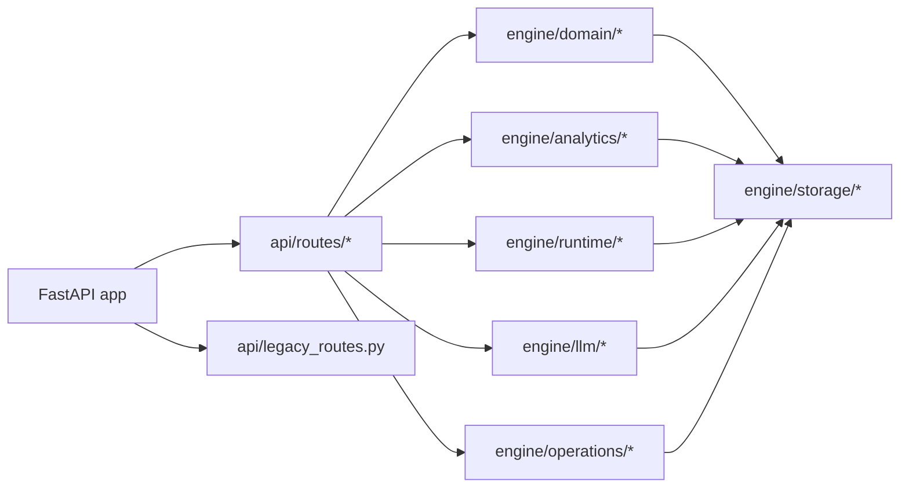
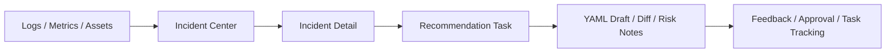
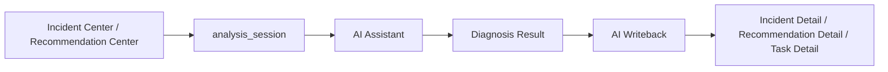

# opsMind Architecture

English version: [architecture.en.md](./architecture.en.md)

## Overview

`opsMind` 是一个面向运维分析场景的全栈应用，核心目标是把流量、资源、异常、建议、任务和 AI 辅助诊断放到同一条产品链路里。

主链路如下：

```text
logs / metrics / assets
  -> traffic / resource analytics
  -> incidents
  -> recommendations
  -> tasks / traces / artifacts
  -> ai assistant / quality metrics
```

## Runtime Composition

后端入口在 [main.py](../main.py)，由 FastAPI lifespan 统一初始化以下能力：

- SQLite 数据库与仓储层
- 任务运行时、trace、artifact 存储
- 资产、signal、异常、建议服务
- AI Provider 与 Router
- 执行插件
- WebSocket 事件通知



## Backend Modules

### API Layer

- [api/routes](../api/routes) 是主产品 API 入口
- [api/routes/__init__.py](../api/routes/__init__.py) 聚合以下主路由：
  - `/api/dashboard/*`
  - `/api/traffic/*`
  - `/api/resources/*`
  - `/api/incidents/*`
  - `/api/recommendations/*`
  - `/api/tasks/*`
  - `/api/metrics/*`
  - `/api/executors/*`
  - `/api/ai/*`
- [api/legacy_routes.py](../api/legacy_routes.py) 仅保留调试与兼容用途，不作为主产品入口

### Runtime Layer

[engine/runtime](../engine/runtime) 负责任务运行时底座：

- `models.py`: 统一任务、证据、回写、会话等核心模型
- `task_manager.py`: 任务创建、恢复、状态推进
- `state_machine.py`: 任务状态流转约束
- `trace_store.py`: trace 明细落盘
- `artifact_store.py`: 大结果外部化
- `event_bus.py`: 任务事件广播

### Domain Layer

[engine/domain](../engine/domain) 负责业务对象与产品逻辑：

- `asset_service.py`: 统一资产模型
- `signal_service.py`: 统一 signal 模型
- `incident_service.py`: 异常聚合与摘要
- `recommendation_service.py`: 建议生成、证据约束、YAML 草稿逻辑

### Analytics Layer

[engine/analytics](../engine/analytics) 负责聚合分析：

- `traffic_analytics.py`: 流量趋势、路径、IP、UA、错误样本
- `resource_analytics.py`: CPU、内存、网络、重启、OOM 风险
- `correlation_engine.py`: 流量异常与资源异常的关联解释
- `summary_builder.py`: 总览页与摘要构建

### AI Layer

[engine/llm](../engine/llm) 提供 AI 能力：

- Provider 配置与默认模型管理
- Router、重试、fallback
- 结构化输出守护
- AI 调用日志

`/api/ai/*` 是唯一主入口；AI 助手、建议复核和 Provider 管理都通过这一层接入。

### Operations Layer

[engine/operations](../engine/operations) 负责只读诊断执行能力：

- 执行插件注册
- Linux / Docker / Kubernetes 只读命令包
- 执行审计、熔断、任务关联

执行结果可以回流为异常或 recommendation 的证据引用。

### Storage Layer

[engine/storage](../engine/storage) 基于 SQLite 承载主业务数据：

- `asset`
- `signal`
- `incident`
- `recommendation`
- `task`
- `artifact_index`
- `analysis_session`
- `ai_writeback`
- `ai_call_log`
- `recommendation_feedback`
- 执行插件相关表

大文本结果、trace 明细和产物正文仍落文件系统，不直接塞入 WebSocket 或大字段响应。

## Frontend Structure

前端位于 [frontend](../frontend)，主入口在 [frontend/src/App.tsx](../frontend/src/App.tsx)。

主页面包括：

- 总览
- 流量分析
- 资源分析
- 异常中心
- 建议中心
- 任务中心
- 质量看板
- AI 助手
- 执行插件
- 能力调试
- 系统设置

主要分层如下：

- `pages/`: 页面级容器
- `components/`: 页面复用组件
- `api/client.ts`: 统一 API 契约层
- `stores/`: 跨页筛选与状态共享

其中：

- `异常中心 / 建议中心 / 任务中心 / AI 助手 / 执行插件` 组成主产品链路
- `CapabilityWorkbench` 属于开发辅助页面，不应被视为主产品入口

## Core Product Flows

### Incident To Recommendation



### AI Assistant Flow



AI 助手不是独立聊天页，而是围绕当前 `incident`、`recommendation`、`service_key`、`time_range` 和证据上下文工作的分析入口。

## Persistence Strategy

持久化策略分为两层：

- SQLite：存结构化主数据、会话、回写、反馈、调用日志
- 文件系统：存 trace 明细、artifact 正文、草稿与 diff 内容

这样可以保持查询简单，同时避免大文本结果拖慢接口与事件流。

## Demo And Debug Boundaries

- [scripts/seed_demo_data.py](../scripts/seed_demo_data.py)：生成演示数据
- [scripts/verify_demo_data.py](../scripts/verify_demo_data.py)：校验演示数据完整性
- [scripts/demo_doctor.py](../scripts/demo_doctor.py)：输出演示环境报告

调试边界：

- [api/legacy_routes.py](../api/legacy_routes.py)
- [frontend/src/components/CapabilityWorkbench](../frontend/src/components/CapabilityWorkbench)

这两部分用于能力调试与兼容，不承载主产品链路。

对外表达建议：

- README、API 文档和前端导航应优先突出主产品链路
- 调试层可以保留，但应以“开发辅助”或“兼容入口”方式出现
- 不建议将 `legacy_routes` 作为外部系统的长期集成面
